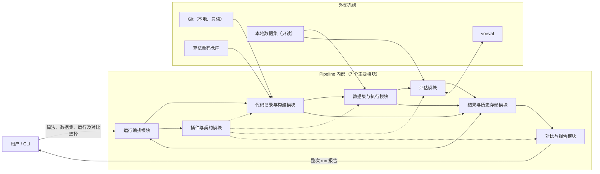
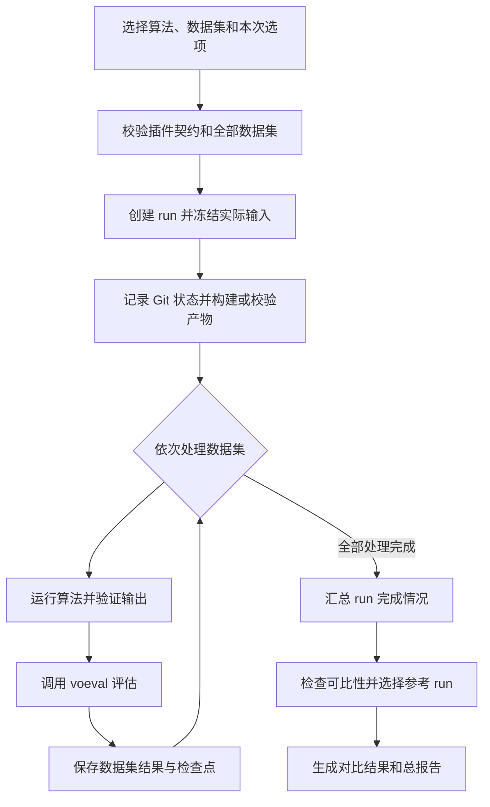

# 算法基线测试系统 —— 系统设计文档（HLD）

## 1. 设计目标与约束

- **算法扩展优先。** 公共流程只依赖稳定的插件契约；新增算法时，变化应集中在该算法的接入实现中，不修改框架和已有算法。
- **结果可追溯优先。** 每次 run 都应绑定实际代码状态、构建来源、算法契约、数据集范围、运行条件和评估规则。
- **可比性先于对比。** 系统只有在算法身份、数据集范围、指标含义和评估条件兼容时才计算变化，不能因指标同名就直接比较。
- **单数据集是最小恢复边界。** 每个数据集完成运行后立即评估并保存；失败、暂停或重启不应破坏此前完成的结果。
- **原始事实与派生结论分离。** 算法输出、单数据集评估结果应保持不变；基线选择、变化计算和报告可在不重跑算法的情况下重新生成。
- **本地单用户优先。** 系统采用用户手动启动的终端流程，不设计代码提交监听、自动触发、Web 管理、多用户、多机或分布式调度。

## 2. 整体架构

实线表示从用户发起运行到生成报告的主要调用、数据流和存储关系；虚线表示构建、执行、评估和报告都受算法插件契约约束。运行编排模块只控制公共流程，算法差异集中在插件与契约模块中。

Git、算法源码仓库、本地数据集和 voeval 位于 Pipeline 边界之外。为保持高层图清晰，图中不再逐项展开构建记录、运行输出、检查点、评估快照和报告等产物；这些内容分别在后续数据流和存储章节说明。

## 3. 算法插件契约（核心章节）

**算法插件不是对算法内部结构的统一，而是算法与公共 Pipeline 之间的能力契约。**框架统一调用时机、输入输出边界和成功语义；插件保留算法在语言、进程、构建方式和结果形态上的差异。

### 3.1 维度 1：身份与适用范围

契约要能回答的问题：

- 如何唯一识别一个算法，并区分算法身份、代码版本、插件契约版本、指标与评估定义版本和一次 run？
- 算法解决什么问题、依赖哪些传感器或数据特征、适用于哪些场景，又明确不适用于哪些场景？
- **数据集在参与运行前必须满足哪些先决条件，框架如何确认这些条件？**
- 算法能提供哪些构建、运行、评估和展示能力，哪些能力是可选的？
- 契约发生变化后，哪些历史结果仍保持原有含义，哪些结果不能再与新结果直接比较？

成功判定：框架能够选中正确算法、确认本次数据集适用，并为 run 冻结一份可追溯的契约；算法身份、代码版本和 run 不会被混为同一概念。

### 3.2 维度 2：构建契约

契约要能回答的问题：

- 本次构建依赖什么源码状态、运行环境、外部依赖和本地资源？
- 框架应从什么构建入口开始，算法在构建前还需要完成哪些自身准备？
- 构建完成后应得到什么可运行产物，如何通过可观察条件确认产物有效？
- 已有构建产物在什么条件下允许复用，如何确认它仍对应当前代码状态和插件契约？
- 构建超时、依赖缺失、产物无效或构建期间源码变化时，应该如何终止并说明原因？

成功判定：框架取得经过校验且来源可追溯的可运行产物；只有命令结束但产物无效，不能判定构建成功。

### 3.3 维度 3：运行契约

契约要能回答的问题：

- 一个数据集如何映射为算法所需输入，运行还需要哪些参数、环境和资源条件？
- 框架如何启动、约束和结束算法，并保证每个数据集形成相互隔离的运行单元？
- 算法会产生哪些原始输出、过程信息和评估所需输出，它们各自承担什么含义？
- 除了进程结束外，如何检查输出完整性、有效覆盖范围和内容有效性？
- 如何区分算法失败、超时、用户暂停和基础设施异常，哪些情况计入算法失败阈值？
- 每个数据集完成后，框架需要保存哪些运行事实，才能支持后续评估、报告和恢复？

若算法需要根据当前代码和本次参数准备运行入口，算法插件必须提供明确规则和验证方法。框架按规则自动准备或调整本次 run 的工作副本，并在正式批量运行前验证入口可运行；验证失败时要求用户修正规则或算法接入内容。整个过程不修改算法源码仓库或用户数据集，框架也不自行猜测算法语义。

成功判定：数据集运行已经结束，契约要求的输出通过有效性检查，运行事实被独立保存且可追溯；否则保存明确失败原因并进入既定失败策略。

### 3.4 维度 4：评估契约

契约要能回答的问题：

- 算法输出和数据集参考信息如何映射为 voeval 可使用的评估输入？
- 本算法适用哪些评估方式和指标，每项指标的含义、单位、好坏方向、有效条件和覆盖范围是什么？
- 评估是否需要对齐、尺度处理或其他上下文条件，这些条件如何进入结果解释？
- 如何区分算法输出不可评估、指标失效、voeval 失败和 Pipeline 基础设施失败？
- 两个结果需要满足哪些算法、数据集、参数、指标、评估定义和运行环境条件，才允许进入对比；耗时、内存等资源指标还需要哪些硬件与测量上下文一致？
- voeval 需要返回什么层次的单数据集结果，如何保持其详细报告与 Pipeline 汇总报告相互独立？

成功判定：每个运行成功的数据集都得到含义明确、条件可追溯的评估结果，或得到明确的不可评估原因；失效值不会被替换为零。

本设计中的 run 级对比要求两次运行选择的数据集集合一致；集合不一致时，系统只展示各自的单次结果，不提供版本变化结论。

### 3.5 维度 5：报告与可视化契约

契约要能回答的问题：

- 该算法最需要突出哪些指标，每项指标如何同时表达值、单位、方向、有效状态以及对应输出的完整性和覆盖范围？
- 哪些内容属于 Pipeline 的整次 run 汇总，哪些单数据集轨迹、误差细节继续交由 voeval 展示？
- 同一算法的版本回归应如何同时对照一个或多个参考 run，显示当前值、参考值、绝对变化、百分比变化和变化方向？
- 不同算法何时允许横向展示，如何防止它与同一算法版本回归混成一个结论？
- 跨数据集如何汇总相对变化，同时避免对量级不同的原始指标求平均？
- 如何分别表达运行失败、指标失效、性能变化和无可比结果，避免用户把它们当成同一种退化？

成功判定：用户能从总报告看清测试范围、完成情况、逐数据集指标和版本变化，并能按需进入 voeval 查看单数据集细节。

跨数据集汇总时，系统先计算每个有效数据集相对参考结果的变化百分比，再按指标汇总这些百分比；失效值不参与计算，但必须在对应指标旁标出失效数量。原始指标值不跨数据集求平均。

参考 run 成功而当前 run 在对应数据集失败时，报告应标为可用性退化，不用零值计算虚假百分比。没有重复样本和波动信息时，报告只能称为观察到的变化，不能声称变化具有统计显著性。

### 3.6 维度 6：接入验证

契约要能回答的问题：

- 哪组具有代表性的最小数据和预期行为可以证明算法已接入，而不是仅能启动？
- 如何逐项确认身份、构建、运行、输出、评估和报告形成完整闭环？
- 如何验证构建失败、算法运行失败、输出无效和评估失败能够被正确归类？
- 如何验证重复运行不会覆盖历史结果，并且不同算法之间保持隔离？
- 如何验证版本回归和不同算法横向比较都受到可比性条件约束？
- 接入验证应保留什么证据，哪些契约变化发生后必须重新验证？

成功判定：算法能在代表性数据上完成端到端 run，异常归因正确，并且接入过程不要求修改框架、已有算法或既有历史结果。

### 3.7 框架与算法作者的责任划分

| 维度 | 算法作者提供 | 框架负责 | voeval 负责 |
|---|---|---|---|
| 身份 | 用途、适用范围、数据要求和能力说明 | 校验与选择算法，冻结契约和代码身份 | — |
| 构建 | 构建入口、依赖、预期产物和成功条件 | 组织构建、约束资源、校验产物并记录来源 | — |
| 运行 | 输入映射、启动要求、输出含义和有效条件 | 逐数据集隔离执行、记录过程、判定失败并保存检查点 | — |
| 评估 | 输出映射、评估方式、指标语义和可比条件 | 发起评估、关联上下文、保存结果并区分异常来源 | 计算单数据集指标并返回评估状态 |
| 报告 | 关注指标、指标方向和算法特有展示要求 | 汇总 run、选择参考、计算变化并展示完整性 | 提供单数据集轨迹和误差细节 |
| 接入验证 | 代表性输入、预期行为和算法成功标准 | 验证端到端闭环、异常归因、隔离性和可追溯性 | 验证单数据集结果可正确计算 |

## 4. 功能模块划分与职责

七个模块共同覆盖功能需求：代码记录与构建模块承担构建编译和版本记录，数据集与执行模块承担数据集管理和算法运行，评估模块负责单数据集评估，结果与历史存储模块保存各阶段结果，对比与报告模块负责回归分析和最终展示；运行编排模块与插件契约为这些功能提供公共流程和算法扩展边界。

### 4.1 运行编排模块

负责接收终端发起的运行、暂停、恢复、查看和对比请求，并按统一顺序推进完整 run。它依赖其余六个模块，但不直接解释算法细节。

对外提供创建 run、控制逐数据集流程、应用失败阈值、恢复未完成 run 和查询总体进度的能力。

### 4.2 插件与契约模块

负责发现、校验、选择和冻结算法插件，将算法差异转换为公共模块可调用的能力。代码记录与构建、数据集与执行、评估以及对比与报告模块都依赖它。

对外提供算法适用性检查、各阶段能力获取、契约兼容性判断和接入验证能力。

### 4.3 代码记录与构建模块

负责只读获取 Git 代码身份与工作区状态，组织构建或校验可复用产物，并确认构建期间代码没有变化。它依赖插件契约，并把构建事实交给存储模块。

对外提供代码快照记录、构建执行、产物有效性检查和构建来源确认能力，不切换版本、不修改仓库。

### 4.4 数据集与执行模块

负责接收数据集路径、在运行前校验全部数据集、建立本次数据集清单，并按清单逐个执行算法。它依赖插件契约和已确认的构建产物。

对外提供数据集适用性检查、隔离工作区准备、算法运行、输出验证和过程信息采集能力。原始数据集始终只读。

### 4.5 评估模块

负责在单个数据集运行成功后立即调用 voeval，并把算法输出、参考数据和评估上下文关联起来。它依赖插件契约、数据集执行结果和 voeval。

对外提供评估前置检查、单数据集指标计算请求、评估结果有效性检查和评估快照保存能力，不承担整次 run 的汇总报告。

### 4.6 结果与历史存储模块

负责保存算法级长期信息、每次 run 的不可变事实、逐数据集检查点和可重新生成的派生结果。所有产生结果的模块依赖它，对比与报告模块从中读取历史。

对外提供原子保存、历史查询、恢复条件验证、结果保护和活动 run 冲突保护能力。

### 4.7 对比与报告模块

负责检查结果可比性、选择参考 run、计算逐数据集逐指标变化，并生成整次 run 报告。它依赖插件契约和历史存储，不直接重新运行算法或计算 voeval 指标。

对外提供基线管理、历史结果选择、版本回归、受约束的算法横向展示、汇总报告和可视化能力。

## 5. 一次 run 的数据流

下图中的方框表示一次 run 的处理阶段，不是新的系统模块；这些阶段均由第 4 节的七个主要模块协作完成。

1. 用户选择一个算法、一个或多个本地数据集和运行选项。失败次数阈值先继承数据集范围的预设策略，用户可以在本次运行中覆盖，最终有效值在启动前冻结。
2. 系统先校验算法契约和全部数据集。任一数据集不符合输入要求时拒绝创建有效 run，提示用户修复后重新发起。
3. 校验通过后创建独立 run，冻结本次实际使用的算法契约、数据集范围、参数、运行环境摘要和评估规则。
4. 系统只读记录 Git 代码状态，随后构建算法或验证已有产物可复用；代码状态在此期间发生变化时停止继续执行。
5. 系统逐个处理数据集：运行算法、检查输出、立即调用 voeval、保存运行与评估事实，然后提交该数据集检查点。
6. 算法在单个数据集上失败时记录失败并继续下一个数据集；全部数据集处理后，算法失败次数超过本次阈值则判定 run 失败，否则判定成功。
7. 用户请求暂停时，系统先完成当前数据集并保存检查点；恢复前必须确认代码、契约、数据集和评估规则均未改变，否则不能从旧检查点继续。
8. run 完成后，系统汇总成功数、算法失败数、失败数据集和评估状态，再决定是否存在兼容的参考 run。
9. 默认参考为同一算法不同代码版本中最近一次兼容且成功的 run；同一代码版本的重复 run 不自动作为默认参考。用户也可以显式选择一个或多个兼容的历史结果或长期基线。
10. 对比与报告属于派生阶段，可以在保存的事实之上重复执行；构建、算法运行和原始输出则不会因更换参考结果而重写。

## 6. 存储结构（顶层）

| 层级 | 保存内容 | 生命周期 |
|---|---|---|
| 全局层 | 已接入算法索引、数据集引用、公共策略和活动操作保护信息 | 跨算法、跨 run 长期存在 |
| 算法层 | 算法身份、契约历史、run 索引和用户指定的基线关系 | 随算法长期存在 |
| run 层 | 代码与构建事实、运行环境、数据集清单、逐数据集运行与评估结果、检查点、对比结果和报告 | 每次运行独立保存 |

顶层按算法组织，算法下保存多个独立 run；Git commit 只是 run 的来源信息，不作为 run 的唯一身份，因此同一 commit 可以保留多次运行。

代码状态、原始输出、过程记录和评估快照属于历史事实，创建后不得被后续 run 覆盖或因插件升级而改写。对比、基线关系和报告属于派生信息，可以基于原始事实重新生成，但需要保留生成时使用的参考关系。

系统需要保护正在写入的 run、算法历史索引和基线关系，避免重复终端操作造成覆盖或索引冲突。历史结果默认保留，只有用户明确删除时才允许移除。

## 7. 错误分类与处理策略

| 类别 | 处理策略 | 是否计入算法失败率 | 是否保留已有结果 |
|---|---|---|---|
| 配置类 | 运行前拒绝整次 run，指出不满足的契约；修复后重新发起 | 否 | 保留诊断信息和既有历史 |
| 输入类 | 任一所选数据集预检失败则拒绝整次 run；运行中输入变化则完成当前安全保存后暂停 | 否 | 保留此前完成的数据集结果 |
| 基础设施类 | 无法继续时暂停或终止后续阶段；条件恢复且快照未变化时允许继续 | 否 | 保留全部已确认事实和检查点 |
| 算法运行类 | 当前数据集记为失败并继续；全部处理后由失败阈值决定 run 结论 | 是 | 保留失败证据和其他数据集结果 |
| 评估类 | 保留算法原始输出，将该数据集标为未评估并继续；修复后可追加新的评估快照，不覆盖原失败记录 | 否 | 保留运行结果及评估诊断 |

voeval 整体不可用属于基础设施问题，而某个有效输入无法完成评估属于评估问题。运行失败、指标失效和性能退化必须分别呈现，不能互相替代。

## 8. 关键扩展点

| 扩展场景 | 受影响的模块 | 不变的模块 | 涉及契约维度 |
|---|---|---|---|
| 新增一个算法 | 新增该算法插件并完成接入验证 | 编排、存储和公共数据流不变 | 全部六个维度 |
| 新增一种数据集输入 | 对应插件的数据要求和输入映射扩展 | 代码记录、存储和报告主流程不变 | 适用范围、运行、评估 |
| voeval 增加评估方式或指标 | 插件评估说明、评估模块和指标展示扩展 | 构建、算法执行和历史事实不变 | 评估、报告、接入验证 |
| 新增报告或可视化视图 | 对比与报告模块增加派生视图 | 构建、执行、评估和既有快照不变 | 报告与可视化 |
| 调整回归比较策略 | 可比性规则、参考选择和变化计算扩展 | 算法运行、voeval 结果和原始历史不变 | 身份、评估、报告 |

扩展不能静默改变既有指标的含义。契约或指标定义变化时，历史结果继续按原快照解释；只有通过兼容性检查的结果才能参与新比较。

## 9. 与外部系统的集成

| 外部系统 | 交互方式 | 方向 | 本系统的假设 | 异常处理 |
|---|---|---|---|---|
| voeval | 本地按数据集发起评估并接收结构化结果 | 双向 | 能区分有效指标、失效指标和评估失败，并保留指标语义 | 保留原始输出和诊断；单项失败继续，整体不可用则暂停 |
| Git | 只读获取当前代码版本和工作区状态 | 外部到本系统 | 算法目录是本地可访问的 Git 仓库，运行期间状态可复核 | 无法读取时拒绝 run；状态变化时停止，不执行切换或写入 |
| 算法源码仓库 | 读取源码要求，执行其构建和运行入口 | 双向调用、仓库只读 | 算法作者已提供完整契约，框架无需推断缺失语义 | 契约不足按配置问题处理；算法异常按运行问题处理 |
| 本地数据集 | 读取用户选择的数据和参考信息 | 外部到本系统 | 路径稳定、内容可读且满足插件声明的数据要求 | 预检失败拒绝 run；运行中变化则暂停并禁止错误恢复 |

## 10. 现有代码的复用与重构

当前 benchmark 仓库承载需求、调研和设计文档；现有可执行原型来自用户确认的 freelance-012/slam_pipeline 本地仓库。新系统应将原型作为迁移来源，而不是沿用其当前模块边界或把它整体复制到文档仓库。

### 10.1 可以复用的思路

- 保留集中加载并在运行前统一校验配置的思路，将其提升为完整的算法插件契约与 run 快照。
- 保留数据集扫描与算法执行分离、运行与评估结果结构化传递的思路。
- 保留进程执行、超时约束、过程输出采集以及按数据集记录进度的基础能力。
- 保留终端交互和进度展示方式，并把原有验证场景转化为新架构的自动化验证输入。
- 原有真值转换和数据准备能力只有在具体算法仍需要时才迁入相应插件，不进入公共 Pipeline。

### 10.2 需要重构的部分

- 将只描述单一算法命令和少量输出约定的配置，重构为覆盖构建、运行、评估、展示和接入验证的插件契约。
- 将集中式整批处理改为“单数据集运行、立即评估、保存检查点”的编排链路。
- 将写入数据集的派生产物迁移到 run 的独立工作区，保证算法仓库与原始数据集不被 Pipeline 改写。
- 将依赖进程退出和隐式目录约定的成功判断，改为插件声明的产物、完整性和内容有效性校验。
- 将公共位置的简单进度记录，改为与代码状态、插件快照、数据集和评估规则绑定的 run 检查点。
- 在现有单次汇总之外新增 Git 记录、构建管理、历史索引、可比性检查、基线关系和回归报告能力。

### 10.3 应退出主流程的内容

- 旧外部评估链路及其文本解析和专用阈值判断，由 voeval 单数据集评估取代。
- 只服务于特定算法、固定数据集目录或固定指标列的隐式公共约定，迁入插件或独立历史导入能力。
- 在原始数据集内生成缓存、转换结果或其他派生内容的做法。
- 依赖目录命名和日志文本推断运行身份与结果归属的主流程。

### 10.4 建议重构顺序

1. 先确定插件契约、run 身份和顶层存储边界。
2. 建立 Git 与构建记录、结果保护和逐数据集检查点。
3. 实现单数据集运行、立即调用 voeval、保存评估快照的主链。
4. 将现有算法的数据准备、运行和输出校验差异迁入各自插件。
5. 在稳定快照之上实现可比性检查、基线选择、历史对比和报告。
6. 最后迁移终端入口和验证场景，新流程通过验收后退出旧链路。

## 11. 待细化问题清单

| 问题 | 影响范围 | 解决阶段 |
|---|---|---|
| 插件如何被发现、注册，以及契约升级如何声明兼容性？ | 插件、历史解释、接入验证 | LLD |
| 已有构建产物满足哪些证据后可以复用？ | 构建、追溯、重复运行 | LLD |
| 数据集如何确认身份和内容未变化，同时保持用户目录只读？ | 数据集、恢复、可比性 | LLD |
| 检查点怎样原子保存，恢复时怎样证明全部上下文相同？ | 存储、编排、可靠性 | LLD |
| 指标的单位、方向、零值、缺失值、对齐和覆盖规则如何统一表达？ | 评估、对比、报告 | LLD |
| 用户基线、最近兼容成功 run 和同 commit 重跑之间如何交互？ | 历史选择、终端体验 | LLD |
| 数据集级失败阈值与本次覆盖值如何合并，重试是否计入失败？ | 运行结论、恢复 | LLD |
| 如何隔离算法资源测量与评估、报告过程，避免测量被污染？ | 指标可信度、执行 | 实现阶段 |
| 总报告采用何种最终载体，终端如何跳转到单数据集详情？ | 报告、易用性 | 实现阶段 |

---

## 自检清单

- [x] 篇幅在 200-400 行之间
- [x] 第 3 节“算法插件契约”是全文最详细的部分
- [x] 第 3 节用“要回答的问题”描述维度，没有出现字段名、类型、默认值
- [x] 没有出现 JSON schema、YAML 示例、字段列表
- [x] 没有具体文件名
- [x] 没有 ID 生成算法、路径解析正则
- [x] 没有错误码枚举
- [x] 架构图里只有 7 个主要模块，没有画到类或函数
- [x] 存储结构只到 3 层
- [x] 第 7 节错误分类为 5 个大类
- [x] 第 8 节扩展点列出了 5 个场景
- [x] 第 11 节列出了需要在后续阶段解决的问题
